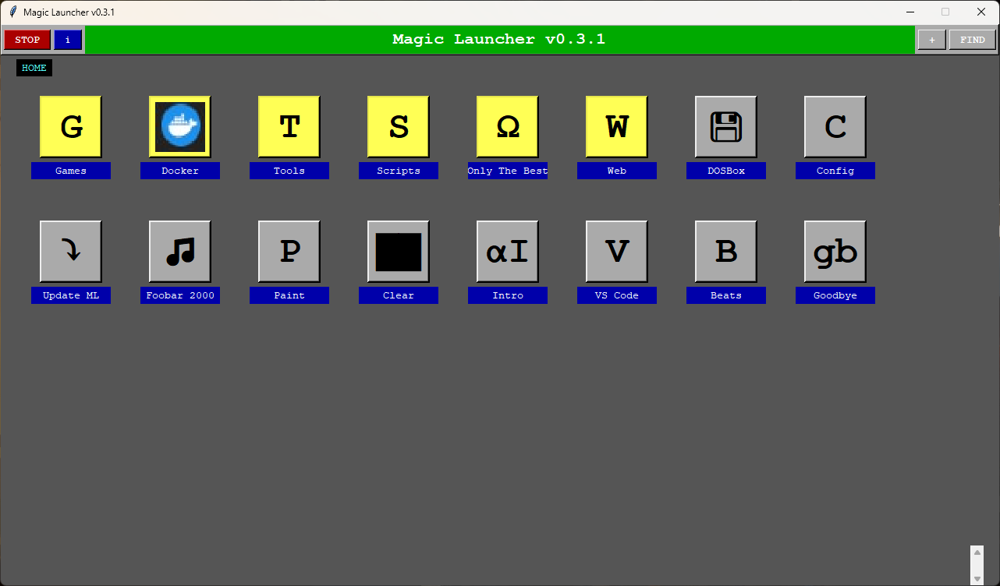

# Frequently Asked Questions

There aren't a ton of these yet but some that people have asked me:

## It looks cool but what is it? 
It's a shortcut palette - similar in functionality and purpose to the graphical application menus people used before Windows became popular.
I've added some modern features - text search, dynamic icons using unicode, and native X11 support so it can run on anything that can software render.
You could also consider it a sort of standalone application dock.

## Who is it for?

Mostly it's for me but I genuinely think it's useful for anyone who needs a good dock or shortcut palette.
If you've ever thought "I just want to click a button and have my thing run," this is for you.

## Is it complicated to set up?
Not at all! Extract the files, run `python app.py`, and start adding shortcuts. Your configuration is just a simple JSON file you can edit or share. No installers, no registry entries, no system modifications.
The only thing you WILL need, is Python - this can be installed easily via the Windows App store, by downloading from the official site, or by using a package manager such as chocolatey (windows), apt (ubuntu/wsl), or yum (RHEL).

## I can't add icons! It complains about Pillow...
You'll need to install the Python Image Library to do that.
```powershell
pip install Pillow
```

```bash
sudo apt install python3-pil
```

## Why can't I resize the window?
To keep things simple I kept things fixed, it's also targeted at running on lower spec machines or smaller screens.
In future I plan to add proper window scaling with dynamic grid size, and options for rearranging shortcuts that don't involve editing text files or onerous duplicate/delete sequences.

## Why do some shortcuts have a red X?
That means the file or program can't be found. The shortcut still works for editing - just right-click to fix the path. It's a visual health check for your shortcuts.

## Can I run multiple instances?
Yes! Each environment gets its own config. Run it on Windows, WSL, Docker and SSH sessions simultaneously - they won't interfere with each other.

## Is it secure?
It only launches what you tell it to. No telemetry, no cloud features, no auto-updates. Your shortcuts stay on your machine.
The app itself is intended to be entirely local and is as secure as the environment you run it from. If someone can launch Magic Launcher, they've already got terminal access with the same privileges.
Please do NOT store any secrets in the shortcuts - it is all plaintext for easy editing. If secrets or variables are required, instead create a script and launch that.

### Addendum
I do plan on implementing several security features, in particular a "read only" launch mode that requires a private key to unlock.

## How is it useful?
I built this to solve one of my own problems, and that's the fact that graphical desktops are generally overcomplicated, bloated, and OS dependent.
These are some of the use cases I overlap:
**For developers:** Same GUI whether you're on bare metal, SSH, or Docker  
**For gamers:** Unified launcher for Steam, GOG, whatever - just point and click  
**For web users:** Browser-independent bookmark storage  
**For administrators:** One-click automation without the enterprise bloat  
**For everyone:** Less relearning when switching between OS environments

## Where did the idea come from?
I haven't actually been asked this but I'll answer anyway because I want to.
The direct source of inspiration was Magic Desk, a DOS application people used for all sorts of things. It was a pretty big part of my childhood as it was the frontend app for the "Arcade Mania 2" shareware CD. It's also been my DOSBox frontend for half a decade at this point.
Original:


Clone:


