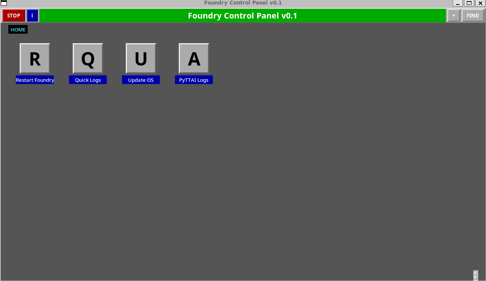

# Frequently Asked Questions

There aren't a ton of these yet but some that people have asked me:

## It looks cool but what is it? 
It's a shortcut palette - similar in functionality and purpose to the graphical application menus people used before Windows became popular.
I've added some modern features - text search, dynamic icons using unicode, and native X11 support so it can run on anything that can software render.

It's fundamental purpose is to launch what you want, when you want it launched, from a GUI that lets you run anything the local command interpreter will accept, on any device, local or remote.

## Who is it for?

Mostly it's for me but I genuinely think it's useful for anyone who needs a good dock or shortcut palette.
Developers and sysadmins who move a lot between devices and folders and applications should find it quickly becomes natural to use.
Retro gamers with multiple emulators, or various versions of source ports, or people who have games on several platforms.
Pinning documents without making your desktop or other folders messy, easy and fast search of added documents should make it useful for planners and project managers.
And even for kiosks, terminals and other low-power edge computers could run it so truck operators and local employees can check their mail, open the HR system, and download their payslip.
If you've ever thought "I just want to click a button and have my thing," this is for you.

## Is it complicated to set up?
Not at all! If you are familiar with using Python from the command line you should already know everything you need to know.
```bash
git clone https://github.com/bladetrain3r/Magic-Launcher
python3 Magic-Launcher/launcher/app.py
```
For those unfamiliar with the command line on their particular OS, you can drag app.py onto a Python shortcut and that should launch it appropriately.

### Dependencies
While it is built to minimise complicated setup, you may need to install a few things:
- In general, you will need the Python Tkinter library, as this is the core behind the UI.
- It should run on your local computer without any additional dependencies.
- To get a GUI remotely, you will need the server running Magic Launcher to have an X Display Server set up. 
- Most Linux and Mac systems should come with some variant of this installed or immediately available.
- Windows users will need to install a 3rd party tool unless you want to pass through an RDC connection (thoroughly untested). Xming is free and easy to use.

## I can't add icons! It complains about Pillow...
You'll need to install the Python Image Library to do that.
```powershell
pip install Pillow
```

```bash
sudo apt install python3-pil
```

## Why can't I resize the window?
To keep things simple I kept things fixed, it's also targeted at running on lower spec machines or smaller screens.
In future I plan to add proper window scaling with dynamic grid size, and options for rearranging shortcuts that don't involve editing text files or onerous duplicate/delete sequences.

## Why do some shortcuts have a red X?
That means the file or program can't be found. The shortcut still works for editing - just right-click to fix the path. It's a visual health check for your shortcuts.

## I can't open (pdf/web links/etc)
You might need to check the program associated for the type of file you are opening is set. 
On linux you may need to install xdg-utils if working remotely to get browsers working.
I cannot guarantee proper default file associations as this is outside of my control, the application hooks to what the OS provides.
An easy workaround is to launch the application as the file target, and put the path to the link/document in the arguments field instead.

## Can I run multiple instances?
Yes! Each environment gets its own config. Run it on Windows, WSL, Docker and SSH sessions simultaneously - they won't interfere with each other.

## Is it secure?
It only launches what you tell it to. No telemetry, no cloud features, no auto-updates. Your shortcuts stay on your machine.
The app itself is intended to be entirely local and is as secure as the environment you run it from. If someone can launch Magic Launcher, they've already got terminal access with the same privileges.
Please do NOT store any secrets in the shortcuts - it is all plaintext for easy editing. If secrets or variables are required, instead create a script and launch that.

### Addendum
I do plan on implementing several security features, in particular a "read only" launch mode that requires a private key to unlock.

## How is it useful?
I built this to solve one of my own problems, and that's the fact that graphical desktops are generally overcomplicated, bloated, and OS dependent.
These are some of the use cases I overlap:
- **For developers:** Same GUI whether you're on bare metal, SSH, or Docker  
- **For gamers:** Unified launcher for Steam, GOG, whatever - just point and click  
- **For web users:** Browser-independent bookmark storage  
- **For administrators:** One-click automation and remote server administration without enterprise bloat. Just scripts and a button click to drive them.
- **For everyone:** Less relearning when switching between OS environments

## Where did the idea come from?
I haven't actually been asked this but I'll answer anyway because I want to.
The direct source of inspiration was Magic Desk, a DOS application people used for all sorts of things. It was a pretty big part of my childhood as it was the frontend app for the "Arcade Mania 2" shareware CD. It's also been my DOSBox frontend for half a decade at this point.
Original Magic Desk:


## Any Real Life uses so far?
Sure! I'm using it myself for a few things already and plan to keep going:
- Running smoothly on AWS EC2 instances for cloud-based admin tasks, specifically...
- I'm running it on an EC2 hosted Foundry VTT server for our GM to manage more easily:


- I'm using it as a launcher for my gaming collection across marketplaces, retro games, and custom maps/mods for DOOM.


- And separately in WSL for more dev/admin related things like Docker stuff.
- And in a Docker Container - combine with preset configs for an easy GUI to run test scripts or checks.
- I'm running it on a Raspberry Pi to launch scripts and check logs. A graphical control center for a fileserver without the NAS software bloat.
- Even using it in my DevOps day job to build out control panels and a few dashboard launcher shortcuts within the dev environment.

And for fun, I've daisy chained it - launched from Powershell, then used it to launch itself in WSL, then in Docker, then a shortcut to run it remotely with X forwarding on a VM.
The software equivalent of Displayport->HDMI->DVI->VGA->USB->RJ32. But it worked!