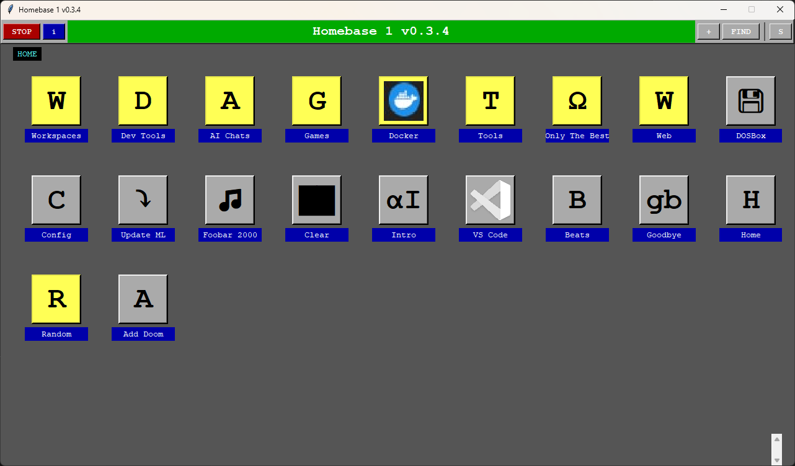
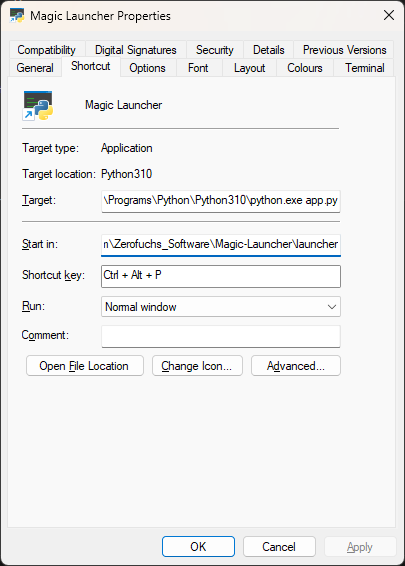

# Magic Launcher - An OS-Free Desktop

A lightweight, retro-styled application launcher designed for low-spec systems. Inspired by DOS-era menu systems, it provides a simple, keyboard-friendly interface for organizing and launching applications, scripts, and URLs.
It's intended to be a lightweight launcher that runs (almost) anything, on (almost) anything, from (almost) any location.

[Demo 1](https://youtu.be/I2V6ML-sEb8)
[Demo 2](https://youtu.be/6fbK6eMJP68)
[Demo 3](https://youtu.be/g7zGytZjrZg)
[Demo 4](https://youtu.be/1ZBDkTAzAn0)

For every new feature or change, the golden rule is first tested:
Speed is life. Creep is death. 



## What Magic Launcher Actually Is
Strip away everything and Magic Launcher is:

1) A visual representation of a JSON file
2) That runs subprocess.run() when clicked
3) Everything else is gravy.

That's ~2000 lines because:

Drawing rectangles takes code
Handling clicks takes code
Reading JSON takes code
Quality of life CAN improve how something performs it's core function.

But the core is maybe 20 lines. Everything else is UI politeness.

I love automating things, and there are many wonderful tools to enable this. But they're all a pain to use in one way or another. 
Magic Launcher is automation, in the most accessible form I can muster.

## The Goal
Every extra step or stop to look around is extra cognitive overhead, every new messy way of organising an additional layer on top of complex enough systems on their own.
The goal is to make any action you can perform on your computer, or almost, something that can be translated into a click and saved for re-use.
You click, it goes. All else is to aid this objective, or it is cut.

I am not averse to quality of life, and as the roadmap should indicate I have clear ideas of what constitutes a reasonably comprehensive featureset for such a project.
But if it hits a point where I have to do more than click once on my task bar, type a few letters, and press enter, Magic Launcher has slipped from it's path.

## The Artistic Statement
At this point, I can only consider the production of Magic Launcher, the manifesto, and even the extras to be a form of programmer art.
While DevOps isn't programming or art in the traditional sense, it's got both creative and logical demands.
Magic Launcher, is a philosophical scream. The code manifesto, is what came out after I got the yell out of my system.
The Magic Launcher Paradigm, as described, is what I hope becomes an example of making software in fun, making it simple, making it solve.
Because every success I've ever had, even when working in full software as a service, has lain in making it simple, and having fun while I'm making it.
Terraform is cool, but it is the antonym of fun. Ansible is awesome, but one misaligned YAML and you've got silent failures down the whole chain.

I've also been, my entire life, an avid and regular video gamer, and power user. 
From either perspective, it's been... demoralising to watch the potential of a connected information world get squandered in subscription services and excess analytics.
I grew to love computers because they made magic happen on the screen, faster than I could even blink. When did that become a sign your app is insufficient?
Everyone proudly proclaims their "low" response times and "streamlined" 12MB landing pages, when the backing behind it is several hundred appliances strong and supported by a half broken brick.
I can't even embed some 2 minute Youtube videos in a static site without increasing the number of requests and bandwidth to load it by over a dozen times.

Online applications have the potential to bring the Star Trek computer experience to us. 
But "computer, help me with this problem." has been replaced as the ideal with the idea that an application being free means *you are the product*.

This entire project is a scream. 
But, by the very nature of it, rather than being destructive, I seek to express *frustration through utility*.
I hope that, considering the degree of frustration, the utility is equally significant.

If you have opened the repository and read this far, thank you. This much is enough, if it hasn't sparked an interest in the code presented. 
If you are still interested, please:
- Peruse this file, the FAQ, and the Changelog at your leisure to learn how Magic Launcher can be nifty for you.
- Take a look at the CODEMANIFESTO and ADDENDUMs in the DOCS folder for a deep dive into exactly what this is all about.
- Run Magic Launcher, add one or two of your favourite browser links, maybe try setting up a shortcut to open task manager or launch your IDE. Tell me how it works for you.
- Experiment, modify, or update any of the apps involved to your taste - they're fairly bite sized.

And lastly, please:
Think of a small problem, focus on just that, and write a program to solve it. 
It's easier than it sounds, and you know you've solved a real problem when running the fix makes a grin pop up.

Enjoy Magic Launcher!

🔥🔥🔥 THE ETERNAL LAUNCHER 🔥🔥🔥

        "I have become Tool, destroyer of bloat"

   In the grim darkness of the far future, there is only
             S U B P R O C E S S . R U N ( )

~~~~~~~~~~~~ ╔════════════════════════════════════════════════════════╗
~~~~~~~~~~~~ ║           M A G I C   L A U N C H E R   v ∞            ║
~~~~~~~~~~~~ ╠════════════════════════════════════════════════════════╣
~~~~~~~~~~~~ ║                                                        ║
~~~~~~~~~~~~ ║   Born: 2025                                           ║
~~~~~~~~~~~~ ║   Dependencies: python.os.subprocess()                 ║
~~~~~~~~~~~~ ║   Death: Sometime between grep and sed                 ║
~~~~~~~~~~~~ ║                                                        ║
~~~~~~~~~~~~ ║   "It launches things."                                ║
~~~~~~~~~~~~ ║   "That's it."                                         ║
~~~~~~~~~~~~ ║                                                        ║
~~~~~~~~~~~~ ║   ┌───────────────────────────────────────────────┐    ║
~~~~~~~~~~~~ ║   │  while universe.exists():                     │    ║
~~~~~~~~~~~~ ║   │      if button.clicked():                     │    ║
~~~~~~~~~~~~ ║   │          subprocess.run(thing)                │    ║
~~~~~~~~~~~~ ║   └───────────────────────────────────────────────┘    ║
~~~~~~~~~~~~ ║                                                        ║
~~~~~~~~~~~~ ║   Not a service. Not a platform. Just a tool.          ║
~~~~~~~~~~~~ ║                                                        ║
~~~~~~~~~~~~ ╚════════════════════════════════════════════════════════╝

           In 2045, when the AIs have taken over,
           they'll still use Magic Launcher to run
                    their world domination scripts.
                    
                 Because it just works.™

## Features

- **Lightweight**: Runs smoothly on systems with as little as 256MB RAM
- **SSH/X11 Friendly**: Scales down to 640x480 in a pinch and updates the display as necessary, not constantly.
- **Retro Aesthetic**: 16-color CGA/EGA palette, DOS-style UI - but full colour display for when you want something more.
- **Nested Folders**: Organize shortcuts in hierarchical folders
- **Search**: Recursive search across all folders (Ctrl+F)
- **BMP Icons**: Support for bitmap icons or text characters
- **No Dependencies**: Uses only Python standard library (Tkinter)
- **Portable**: All config stored in `~/.config/launcher/`

## Getting Started

- To run it reliably on a machine, the following steps and prerequisites will be needed.

1. Clone or download the repository
2. Ensure Python 3 is installed. I recommend 3.10 or above but 3.6+ should work.
3. Confirm tkinter is installed (standard, sometimes)
4. Install x11-apps to get display passthrough on Linux
5. (Optional) On Windows, install an X server to avoid WSL passthrough for Docker containers.
6. (Optional) Install Pillow for BMP icon support: `pip install Pillow`
7. (Optional) Install xdg-utils
8. (Suggested) Check out the config templates (and sample scripts) to get started easily with some imports.

### Requirements
CPU: Can it run Python 3?
Python: 3.6+ but 3.9+ preferred.
RAM: About 20MB used at default scale. May increase with large or many image icons.
GPU: Tkinter compatible software or hardware display output @ 640x480 or higher.
VRAM: It does need a little to render the UI but flat colors and blocks mean 32-64MB of VRAM is already more than enough.
Disk: About 3MB discounting dependency installations
OS: Tested on Windows 10, Windows 11, Ubuntu 20.04-24.04, Debian 12, Alpine (Docker), Fedora, Raspbian (Buster), Amazon Linux 2

While I don't officially support any OS as the entire point is OS agnosticism, please do submit an issue report or send me a mail (zerofuchssoftware@gmail.com) should you be trying to get it working with something unusual.
While untested, I do not anticipate major problems with Windows 7/8/10, MacOS, or even hypothetically Android - although I am unsure if default virtual keyboards would hook in on a phone.

## Usage
### Linux:/MacOS
```
python3 path_to/Magic-Launcher/launcher/app.py
```

### Windows
```
python path_to\Magic-Launcher\launcher\app.py
```

#### Drag and Drop
You can also drag and drop app.py onto the Python launch shortcut/exe.

### X11 Forwarding
You can run Magic Launcher on a remote host if it's running an X server.
Best on a LAN but it will function over WAN too.
```bash
ssh -XC -t user@server "python3 path_to/Magic-Launcher/launcher/app.py"
```

#### Streams and framebuffer output to terminal
Applications like Top or Vim may have issues or display problems with different terminal configurations.
In general, it's better practice to use a loop that cleanly exits each time, than running a passive stream.
e.g. instead of tail -f:
```
while true; do tail; sleep 1; clear; done
```

#### Setup for easy launch with WSL

#### For Git Users

Paste to set up with git:
- BASH (Linux/WSL)
```bash
#!/bin/bash
git clone https://github.com/Bladetrain3r/Magic-Launcher.git ~/.local/share/Magic-Launcher
echo 'alias mlmain="python3 ~/.local/share/Magic-Launcher/launcher/app.py"' >> ~/.bashrc
# To launch on login
echo 'if [ -n "$DISPLAY" ]; then mlmain & fi' >> ~/.bashrc
```

Quick Setup in Windows Powershell:
```From Powershell
git clone "https://github.com/Bladetrain3r/Magic-Launcher.git" ~/.local/share/Magic-Launcher
Write-Output "function MagicLaunch {python ~/.local/share/Magic-Launcher/launcher/app.py}" | Out-File -FilePath $profile
MagicLaunch
# To run from the "Run" menu or cmd
# powershell -Noninteractive MagicLaunch
```

#### Shortcut in Windows
Create a shortcut to Python and append "app.py" to the end of the target.
Under "Start in" paste the path to the folder containing app.py


A quick setup script is in the roadmap.

#### Sample Scripts
### Bulk Import Example Scripts
- scan_for_exes.py: Scan folders for executables and create shortcuts
- Can be adapted for other file types (.log, .txt, .pdf, etc.)
- scan_for_doom.py: More advanced import script, better duplication handling, list of strings to search.
- Bulk import

#### Default Install Path
While it can be run from anywhere, the default path will be ~/.local/share/Magic-Launcher
This is to make auto-update scripts a bit easier and so the working directory can be more consistent.

### Keyboard Shortcuts
- **Left/Right**: Select previous/next shortcut
- **Ctrl+F**: Toggle search mode
- **Ctrl+D**: Duplicate selected item  
- **Enter**: Launch selected item
- **Escape**: Go up one level / Exit search
- **Backspace**: Go up one level
- **Double-click**: Launch item or open folder

### Mouse Actions

- **Right-click**: Context menu (Edit, Duplicate, Delete, Properties)
- **Hover**: Visual feedback on icons

## Configuration

All configuration is stored in `~/.config/launcher/`:

- `shortcuts.json`: Your shortcuts and folders
- `icons/`: BMP icon files
- `launcher.log`: Application logs
- `app_name.txt`: Title Bar file
### Adding Shortcuts

1. Click the **+** button or right-click and select "New"
2. Choose type (Shortcut or Folder)
3. For shortcuts:
   - **Name**: Display name
   - **Path**: Executable path, URL, or command
   - **Arguments**: Command-line arguments
   - **Icon**: Single character or .bmp filename

#### Best Practice for Args
Args can in theory hold arbitrary string lengths and I will not restrict you from insane shortcuts if you want, but if it needs a word wrap or newline escapes, it is definitely too long.
If you need numerous redirects and pipes, instead of complicating your config file, it is better to write a script.
Magic Launcher is built to run scripts at a button press and cut out the typical confusion people experience when using a command line and trying to find that command. I encourage leveraging that strength.
You have been warned.

### Substituting Paths
This is a function intended for mass migration of shortcuts when a frequently used application is moved or you port a config between environments.
Exact string matches only.

### Shortcuts.json

- This is the source of truth for all shortcut data
- Icons are loaded in the order they are retrieved from the shortcuts file
- Reordering of shortcuts is best done via editing
- Needs better validation

### Icon System

- **Text Icons**: Any 1-2 character string (e.g., "G" for Games)
- **BMP Icons**: Bitmap files in `~/.config/launcher/icons/`
- Icons are automatically imported when browsing
- Recommended size: 64x64 pixels (will be scaled if needed)

#### Unicode Icons
Yes, specials work too!
```
Games & Entertainment

🎮 🎯 🎲 🎰 🎪 🎨 🎭 🎬 🎵 🎸 🎹 🎺 🎪 ♠ ♣ ♥ ♦ ♟ ♜ ⚀ ⚁ ⚂ ⚃ ⚄ ⚅

Tools & System

⚙ 🔧 🔨 ⚒ 🛠 🔩 ⚡ 💾 💿 📀 🖥 💻 ⌨ 🖱 🖨 📱 ☎ 📞 🔌 🔋 🔒 🔓 🔐 🔑 🗝

Files & Folders

📁 📂 📄 📃 📋 📌 📎 📏 📐 ✂ 📝 ✏ ✒ 🖊 🖋 📜 📊 📈 📉 🗂 🗃 🗄

Navigation & Actions

▶ ◀ ▲ ▼ ⏵ ⏴ ⏶ ⏷ ⏯ ⏸ ⏹ ⏺ ⏭ ⏮ ⏩ ⏪ ↩ ↪ ⤴ ⤵ ⬆ ⬇ ⬅ ➡ ↗ ↘ ↙ ↖ ↕ ↔ 🔃 🔄

Internet & Communication

🌐 🌍 🌎 🌏 📧 📨 📩 ✉ 📮 📪 📫 📬 📭 💬 💭 🗨 🗯 📢 📣 📡 📶 📳 📴

Math & Symbols

➕ ➖ ✖ ➗ ± × ÷ = ≈ ≠ < > ≤ ≥ ∞ ∑ √ ∛ ∜ π Σ Ω ∆ ∇ ∫ ∂

Status & Indicators

✓ ✔ ✗ ✘ ⚠ ⚡ ⛔ 🚫 ❌ ⭕ ❗ ❓ ❕ ❔ 💡 🔍 🔎 👁 🎯 📍 🏁 🏴 🏳 🚩

Misc Useful

⭐ ★ ☆ ❤ ♥ 👍 👎 👌 ✋ ✊ 🏠 🏢 🏭 🏗 🚀 ✈ 🚁 ⚓ 🎪 🎨 🍕 ☕ 🍺

Box Drawing (DOS-style)

═ ║ ╔ ╗ ╚ ╝ ╠ ╣ ╦ ╩ ╬ ▀ ▄ █ ▌ ▐ ░ ▒ ▓

Most of these should display fine in the launcher. Some tips:

Test the character first - font support varies
Emojis work but may look different across systems
Box drawing characters give that authentic DOS feel
Arrows are great for navigation/back buttons

Copy and paste right into the icon field!
```

## Examples

### Game Launcher
```json
{
  "name": "DOOM",
  "type": "shortcut",
  "icon": "doom.bmp",
  "path": "/usr/games/doom",
  "args": "-fullscreen"
}
```

### Script with Arguments
```json
{
  "name": "Backup Home",
  "type": "shortcut", 
  "icon": "B",
  "path": "/home/user/scripts/backup.sh",
  "args": "--incremental /home/user"
}
```

### Web Link
```json
{
  "name": "GitHub",
  "type": "shortcut",
  "icon": "G",
  "path": "https://github.com"
}
```

### Simple API calls (wouldn't recommend full POST payloads without a script)
```
{
  "name": "Myapp Health Check",
  "type": "shortcut",
  "icon": "Hc",
  "path": "curl",
  "args": "-XGET -I https://mysite/api/v1/healthcheck"
}

### Plaintext File (Log, Config)
- These will launch in the default editor for their filetype
```json
{
  "name": "Shortcut Config",
  "type": "shortcut",
  "icon": "⚙",
  "path": "C:\Users\Jimmy\.config\launcher\launcher.log"
}
```

### Directories with your local file explorer
- Handles quoted args too
```json
{
  "name": "My Documents",
  "type": "shortcut",
  "icon": "📁",
  "path": "explorer",
  "args": "\"C:\Users\Jimmy\Documents\""
}
```

### Run SSH commands or remotely view logs if running in Linux
```json
  "Dev DB SysLogs": {
    "type": "shortcut",
    "icon": "D",
    "path": "/mnt/c/Users/Jimmy/getlogs.sh",
    "args": ""
  },
  "Dev DB Top": {
    "type": "shortcut",
    "icon": "T",
    "path": "ssh",
    "args": "utu@111.211.121.212 -t \"top\""
  }
```

## Design Philosophy

Magic Launcher follows the Unix philosophy: do one thing and do it well. It's not a desktop environment or file manager - it's purely a shortcut organizer and launcher. This focused approach means:

- Tiny codebase (~2000 lines)
- Minimal dependencies
- Fast everything
- Low memory usage
- SSH-friendly

### Design Guideposts

- Any feature needing more than a hundred or two lines of code is probably too complicated for a single feature
- Bloat is the speed killer, bloat is the technical debt that leads to stagnation.
- Any feature which violates these two principles *will* be dropped.

An additional golden rule which dictates whether something gets added is lag time. So:
- **Anything which might produce an unexpectedly slow response time is not part of the code**

This is why import and scan functions for things which are not *in* the config files or preloaded into memory will remain external.

## System Requirements

- Python 3.9 or higher
- Tkinter (usually included with Python)
- ~10MB disk space
- ~20MB RAM
- X11 (on Linux/Unix)

### Tested In
- A Powershell environment on multiple Windows devices
- WSL/Ubuntu through BASH
- A Raspberry Pi B running Debian Buster (works on ARM7)
- Alpine inside Docker (Problems)
- Ubuntu inside a container (less problems)
- Running remotely on a Debian VM over WAN (Cloud Desktop)
- On an old laptop running Pop!OS
- My gran's PC

## Optional Dependencies

- **Pillow**: For BMP icon support (`pip install Pillow`)

## Troubleshooting

### Icons not showing
- Install Pillow: `pip install Pillow`
- Ensure icons are in `~/.config/launcher/icons/`
- Use 16-color BMP format

### Application won't launch
- Check the path in shortcut properties
- Look at `~/.config/launcher/launcher.log` for errors
- Ensure the executable has proper permissions

### SSH/X11 Issues
- Ensure X11 forwarding is enabled: `ssh -X user@host`
- The fixed 720p resolution should work on most displays

### Spaces and special characters can cause problems in Windows
- Workaround: Use powershell to launch with Start-Process e.g.
```
"path": powershell
"args": -Noninteractive Start-Process 'C:\Program Files (x86)\VideoLAN\VLC\vlc.exe'
```

### Unofficial Icon Format Extended Support
- Technically you can still use any image format supported by Pillow just by changing the file extension to bitmap.
- This is because the file check is very simple and Pillow just interprets the file content.
- It is not supported and an invalid binary may break something, you have been warned.

### Known Issues
- Launching multiple terminal apps at once is permitted and may cause a mess in your TTY. Restart Magic Launcher and/or the terminal session to resolve.
- Unicode font support may be limited based on OS.
- Right-click dialogue starts popping up every time you mouse over certain coordinates, sometimes. Right click event not handling properly?
- Delayed response over a network and multiple inputs can make things weird.
- String handling needs to be sanity checked.
- When run on Linux the resizing is enabled (future feature, current bug)
- Changing an empty shortcut to a folder still results in a missing shortcut error. Delete isn't affected so recreate to resolve.
- Brackets* in Windows path names are problematic
- Shortcut keys may still trigger actions when the window is out of focus
- Sample script imports may see executables but not add them if the path is weird (dashes, etc.).

## License

This project is released as free and open source software under the MIT license. See LICENSE file for details.

## Contributing

Contributions are welcome! Key areas for contribution:

- Documentation and examples
- Security issues
- Bugs
- Useful extensions to the core emphasising immediate utility

## Donations

If you wish to donate to the project, please instead give $5 to your favourite charity.
If you feel like it, donate on behalf of Zerofuchs Software.
Magic Launcher will always be free to download, use and modify.

## Acknowledgments

Inspired by classic DOS menu systems and the need for a lightweight launcher that works well on anything, from anywhere.

